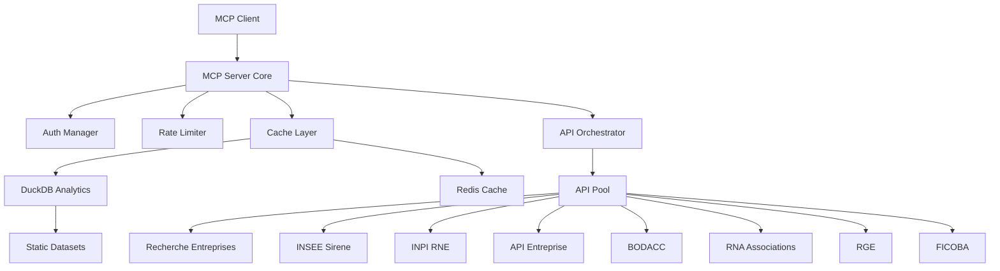

# Product Requirements Document (PRD)
## French Company Intelligence MCP Server - Complete Specification
### Version 2.0 - Final Production Specification

---

# Project Context & Goals
## To be added at the beginning of the PRD

---

## Project Overview

### Background
The French business intelligence market is dominated by expensive proprietary solutions (Pappers, Societe.com, Infogreffe) charging €50-500/month for API access to public data. Meanwhile, the French government provides free access to this same data through multiple APIs, but their fragmentation and complexity make direct integration challenging for most organizations.

This project creates an open-source MCP (Model Context Protocol) server that democratizes access to French company intelligence by providing a unified, intelligent interface to all government business data sources.

### Vision Statement
**"Transform fragmented French public business data into actionable intelligence accessible to every LLM and AI system, enabling data-driven decisions without proprietary gatekeepers."**

---

## Business Objectives

### Primary Goals
1. **Unify Access**: Single interface to 8+ government APIs and 3+ static datasets
2. **Ensure Reliability**: 99.5% uptime with intelligent caching and fallbacks
3. **Maximize Performance**: Sub-second responses for 95% of queries
4. **Guarantee Compliance**: 100% RGPD compliant with full audit trail
5. **Enable Intelligence**: Provide enriched data beyond raw API responses

### Success Metrics
- **Adoption**: 1,000+ active installations within 6 months
- **Performance**: P95 latency < 2 seconds
- **Coverage**: 100% of French companies and associations
- **Cost**: 90% reduction vs commercial alternatives
- **Reliability**: < 1% error rate excluding upstream failures

---

## Target Users & Use Cases

### Primary Users
1. **Government Agencies**
   - Public procurement verification
   - Grant/subsidy due diligence
   - Regulatory compliance checks

2. **Financial Institutions**
   - KYC/AML compliance
   - Credit risk assessment
   - Investment due diligence

3. **AI/LLM Applications**
   - Automated research assistants
   - Business intelligence chatbots
   - Compliance automation tools

4. **Researchers & Journalists**
   - Corporate network analysis
   - Public spending investigation
   - Market research

### Key Use Cases
1. **Real-time Verification**: "Is this company eligible for our public contract?"
2. **Due Diligence**: "What is the complete history and current status of this entity?"
3. **Risk Assessment**: "Show me all bankruptcy procedures for companies in this sector"
4. **Compliance Check**: "Verify this IBAN belongs to the declared company"
5. **Market Analysis**: "Find all certified companies in renewable energy in Paris"

---

## Competitive Advantages

### vs Commercial Providers (Pappers, Infogreffe)
- **Cost**: Free vs €50-500/month
- **Coverage**: Includes associations, not just companies
- **Transparency**: Open source, auditable algorithms
- **Integration**: Native MCP protocol for AI systems

### vs Direct API Usage
- **Simplicity**: 1 auth vs 7 different mechanisms
- **Reliability**: Automatic failover and caching
- **Performance**: Parallel queries with intelligent routing
- **Enrichment**: Cross-source data fusion and validation

---

## Critical Constraints

### Legal Constraints
1. **RGPD Compliance**: Must respect all privacy laws
2. **License Terms**: Strict adherence to each API's terms
3. **Data Retention**: No permanent storage of personal data
4. **Audit Requirements**: Complete traceability for FICOBA access

### Technical Constraints
1. **Rate Limits**: Must respect all upstream limits
2. **Authentication**: Support 7 different auth mechanisms
3. **Data Volume**: Handle 20M+ companies/associations
4. **Latency**: Network latency to government servers

### Business Constraints
1. **No Commercial Use**: Some APIs restrict commercial usage
2. **French Only**: Limited to French entities
3. **Public Data Only**: No access to private databases

---

## Explicit Out of Scope

### Not Included in V1
1. **Data Persistence**: No long-term data warehouse
2. **Prediction Models**: No ML/AI predictions
3. **International Data**: French entities only
4. **Payment Processing**: No billing/payment features
5. **User Management**: MCP handles authentication
6. **Custom Dashboards**: API only, no UI
7. **Real-time Streaming**: Request/response only
8. **Data Modification**: Read-only access

### Future Considerations (V2+)
- European company data (via VIES, EORI)
- Predictive bankruptcy models
- Graph database for relationship mapping
- Real-time event streaming via webhooks
- Historical trend analysis

---

## Risk Mitigation

### Technical Risks
| Risk | Impact | Mitigation |
|------|--------|------------|
| API deprecation | High | Monitor announcements, abstract interfaces |
| Rate limit changes | Medium | Dynamic limit adjustment, graceful degradation |
| Auth mechanism changes | High | Modular auth system, quick update capability |
| Data schema changes | Medium | Schema validation, backwards compatibility |

### Legal Risks
| Risk | Impact | Mitigation |
|------|--------|------------|
| RGPD violation | Critical | Privacy by design, legal review |
| Terms violation | High | Strict compliance monitoring |
| Data misuse | High | Comprehensive audit logging |

---

## Project Principles

### Technical Principles
1. **API First**: Every feature accessible via API
2. **Fail Gracefully**: Partial data better than no data
3. **Cache Aggressively**: Minimize upstream calls
4. **Monitor Everything**: Full observability
5. **Document Thoroughly**: Self-documenting APIs

### Data Principles
1. **Source Priority**: RNE > Sirene > Historical
2. **Privacy First**: When in doubt, redact
3. **Transparency**: Always indicate data sources
4. **Accuracy**: Validate cross-source consistency
5. **Freshness**: Clear data age indicators

---

## Definition of Done

### MVP Requirements
- [ ] All 8 APIs integrated and tested
- [ ] Static data pipeline operational
- [ ] 100% privacy filter coverage
- [ ] Full MCP protocol compliance
- [ ] Docker image < 500MB
- [ ] API documentation complete
- [ ] Load test passed (1000 concurrent users)
- [ ] Security audit passed
- [ ] RGPD compliance verified
- [ ] 80% test coverage achieved

### Production Readiness
- [ ] Kubernetes manifests tested
- [ ] Monitoring dashboards configured
- [ ] Alerting rules active
- [ ] Backup/recovery tested
- [ ] Documentation published
- [ ] License headers added
- [ ] CHANGELOG.md updated
- [ ] GitHub releases automated

---

## 1. Executive Summary

Build a production-grade MCP (Model Context Protocol) server that provides comprehensive French company and association intelligence by orchestrating 8 public APIs and 3 static datasets. The server must handle authentication for 7 different auth mechanisms, implement intelligent caching, respect all rate limits, and deliver sub-second responses for 95% of queries.

**Delivery Requirements:**
- Docker image: `ghcr.io/org/fci-mcp:{{git-sha}}`
- Kubernetes-ready with Helm charts
- Full OpenTelemetry instrumentation
- 100% RGPD compliant
- Production-ready in 12 weeks

---

## 2. Architecture Overview

### 2.1 System Components



### 2.2 Technology Stack

- **Language**: Python 3.12
- **MCP Framework**: FastMCP 0.9.3
- **HTTP Client**: httpx[http2] 0.27
- **Validation**: Pydantic 2.7
- **Cache**: Redis 7.2 + DuckDB 0.10
- **Analytics**: DuckDB for Parquet processing
- **Monitoring**: OpenTelemetry + Prometheus
- **Container**: Docker with distroless base

---

## 3. API Specifications

### 3.1 API: Recherche d'Entreprises (No Auth)

**Base URL**: `https://recherche-entreprises.api.gouv.fr`

#### Endpoint: Search Companies
```http
GET /search
```

**Request Parameters:**
| Parameter | Type | Required | Description | Example |
|-----------|------|----------|-------------|---------|
| q | string | Yes | Search query | "Eiffage" |
| page | integer | No | Page number (default: 1) | 1 |
| per_page | integer | No | Results per page (max: 25) | 20 |
| naf | string | No | NAF code filter | "4312A" |
| code_postal | string | No | Postal code filter | "75001" |
| departement | string | No | Department code | "75" |
| tranche_effectif | string | No | Employee range | "12" |
| etat_administratif | string | No | A=Active, C=Ceased | "A" |

**Response (200 OK):**
```json
{
  "results": [
    {
      "siren": "123456789",
      "siret": "12345678901234",
      "nom_complet": "EIFFAGE SA",
      "nom_raison_sociale": "EIFFAGE",
      "denomination": "EIFFAGE",
      "activite_principale": "4312A",
      "libelle_activite_principale": "Travaux de terrassement courants",
      "naf": "4312A",
      "tranche_effectif": "12",
      "libelle_tranche_effectif": "100 à 199 salariés",
      "caractere_employeur": "O",
      "etat_administratif": "A",
      "date_creation": "1990-01-15",
      "siege": {
        "siret": "12345678900001",
        "adresse": "3 PLACE DE L'EUROPE",
        "code_postal": "78140",
        "commune": "VELIZY VILLACOUBLAY",
        "latitude": 48.783,
        "longitude": 2.218
      },
      "dirigeants": [
        {
          "nom": "DUPONT",
          "prenoms": "Jean",
          "fonction": "Président directeur général",
          "date_naissance": "1960-05"
        }
      ]
    }
  ],
  "total_results": 156,
  "page": 1,
  "per_page": 20,
  "total_pages": 8
}
```

**Rate Limit**: 50 req/s/IP

---

### 3.2 API: INSEE Sirene V3.11 (OAuth2)

**Base URL**: `https://portail-api.insee.fr/entreprises/sirene/V3.11`

#### Authentication Flow
```http
POST https://portail-api.insee.fr/token
Content-Type: application/x-www-form-urlencoded

grant_type=client_credentials&client_id={{INSEE_CLIENT_ID}}&client_secret={{INSEE_CLIENT_SECRET}}
```

**Response:**
```json
{
  "access_token": "eyJ0eXAiOiJKV1QiLCJhbGciOiJSUzI1NiIsIng1dCI6Ik...",
  "expires_in": 3600,
  "token_type": "Bearer",
  "scope": "default"
}
```

#### Endpoint: Get Legal Unit
```http
GET /siren/{siren}
Authorization: Bearer {{access_token}}
Accept: application/json
```

**Response (200 OK):**
```json
{
  "header": {
    "statut": 200,
    "message": "ok"
  },
  "uniteLegale": {
    "siren": "123456789",
    "statutDiffusionUniteLegale": "O",
    "dateCreationUniteLegale": "1990-01-15",
    "sigleUniteLegale": "EIF",
    "prenomUsuelUniteLegale": null,
    "identifiantAssociationUniteLegale": null,
    "trancheEffectifsUniteLegale": "12",
    "categorieEntreprise": "ETI",
    "etatAdministratifUniteLegale": "A",
    "denominationUniteLegale": "EIFFAGE",
    "categorieJuridiqueUniteLegale": "5710",
    "activitePrincipaleUniteLegale": "41.20A",
    "nomenclatureActivitePrincipaleUniteLegale": "NAFRev2",
    "nicSiegeUniteLegale": "00001",
    "periodesUniteLegale": [
      {
        "dateFin": null,
        "dateDebut": "2008-01-01",
        "etatAdministratifUniteLegale": "A",
        "denominationUniteLegale": "EIFFAGE",
        "categorieJuridiqueUniteLegale": "5710"
      }
    ]
  }
}
```

**Rate Limit**: 30 req/min/token

---

### 3.3 API: INPI RNE (JWT Login)

**Base URL**: `https://registre-national-entreprises.inpi.fr/api`

#### Authentication
```http
POST /sso/login
Content-Type: application/json

{
  "username": "{{INPI_USERNAME}}",
  "password": "{{INPI_PASSWORD}}"
}
```

**Response (201 Created):**
```json
{
  "token": "eyJ0eXAiOiJKV1QiLCJhbGciOiJIUzI1NiJ9..."
}
```

#### Endpoint: Get Company Details
```http
GET /companies/{siren}
Authorization: Bearer {{token}}
```

**Response (200 OK):**
```json
{
  "siren": "123456789",
  "formality": {
    "content": {
      "formeJuridique": {
        "code": "5710",
        "libelle": "Société anonyme à conseil d'administration"
      },
      "capital": {
        "montant": 380000000,
        "devise": "EUR",
        "capitalVariable": false
      },
      "beneficiairesEffectifs": [
        {
          "nom": "DUPONT",
          "prenom": "Jean",
          "dateNaissance": "1960-05-15",
          "nationalite": "FR",
          "modalitesControle": ["MAJORITE_CAPITAL"]
        }
      ],
      "representants": [
        {
          "qualite": "Président du conseil d'administration",
          "personne": {
            "typePersonne": "PHYSIQUE",
            "nom": "DUPONT",
            "prenom": "Jean",
            "dateNaissance": "1960-05-15"
          }
        }
      ],
      "etablissements": [
        {
          "siret": "12345678900001",
          "estSiege": true,
          "adresse": {
            "voie": "3 PLACE DE L'EUROPE",
            "codePostal": "78140",
            "commune": "VELIZY VILLACOUBLAY"
          }
        }
      ]
    }
  }
}
```

**Rate Limit**: 600 req/day, 100 req/5min

---

### 3.4 API: API Entreprise (Long JWT)

**Base URL**: `https://entreprise.api.gouv.fr/v3`

**Required Headers (ALL requests):**
```http
Authorization: Bearer {{API_ENTREPRISE_TOKEN}}
X-Recipient-Id: {{SIREN_OR_SERVICE}}
X-Recipient-Object: {{PROJECT}}
X-Recipient-Context: {{SUBPROJECT}}
```

#### Endpoint: Get INPI Acts and Accounts
```http
GET /inpi/rne/actes_bilans/{siren}
```

**Response (200 OK):**
```json
{
  "data": [
    {
      "type_document": "BILAN",
      "date_depot": "2023-07-15",
      "annee": 2022,
      "url": "https://entreprise.api.gouv.fr/v3/inpi/rne/actes_bilans/123456789/document/abc123",
      "nom_fichier": "BILAN_2022_123456789.pdf"
    },
    {
      "type_document": "ACTE",
      "date_depot": "2023-06-01",
      "description": "Procès-verbal d'assemblée générale",
      "url": "https://entreprise.api.gouv.fr/v3/inpi/rne/actes_bilans/123456789/document/def456"
    }
  ]
}
```

**Rate Limits**: 
- JSON endpoints: 250 req/min
- PDF downloads: 50 req/min

---

### 3.5 API: BODACC (No Auth)

**Base URL**: `https://bodacc-datadila.opendatasoft.com/api/v2`

#### Endpoint: Search Announcements
```http
GET /catalog/datasets/annonces-commerciales/records
```

**Query Parameters:**
| Parameter | Type | Description | Example |
|-----------|------|-------------|---------|
| where | string | ODS query language | "registre='RCS' AND numeroimmatriculation='123456789'" |
| limit | integer | Max results (100) | 20 |
| offset | integer | Pagination offset | 0 |
| order_by | string | Sort field | "dateparution DESC" |

**Response (200 OK):**
```json
{
  "total_count": 42,
  "records": [
    {
      "record": {
        "id": "abc123",
        "timestamp": "2024-01-15T10:30:00Z",
        "fields": {
          "numeroimmatriculation": "123456789",
          "registre": "RCS",
          "denomination": "EIFFAGE SA",
          "formeJuridique": "Société anonyme",
          "typeAnnonce": "Modification",
          "dateparution": "2024-01-15",
          "numeroannonce": "12345",
          "texteannonce": "Modification du capital social...",
          "capital": {
            "ancien": 350000000,
            "nouveau": 380000000,
            "devise": "EUR"
          },
          "tribunal": "VERSAILLES"
        }
      }
    }
  ]
}
```

---

### 3.6 API: RNA Associations (No Auth)

**Base URL**: `https://api-asso.djepva.fr/api/v2`

#### Endpoint: Search Associations
```http
GET /associations
```

**Query Parameters:**
| Parameter | Type | Description | Example |
|-----------|------|-------------|---------|
| q | string | Search query | "croix rouge" |
| departement | string | Department filter | "75" |
| page | integer | Page number | 1 |
| per_page | integer | Results per page (max: 100) | 50 |

**Response (200 OK):**
```json
{
  "associations": [
    {
      "id_association": "W751234567",
      "siret": "77567227200419",
      "titre": "CROIX-ROUGE FRANCAISE",
      "objet": "Prévenir et apaiser toutes les souffrances humaines...",
      "date_creation": "1864-05-25",
      "date_declaration": "1945-07-07",
      "date_publication": "1945-08-01",
      "adresse_siege": {
        "voie": "98 RUE DIDOT",
        "code_postal": "75014",
        "commune": "PARIS"
      },
      "regime": "Loi 1901",
      "utilite_publique": true,
      "agrement": ["SECURITE_CIVILE", "SERVICE_CIVIQUE"],
      "etat": "ACTIVE"
    }
  ],
  "pagination": {
    "total": 156,
    "per_page": 50,
    "current_page": 1,
    "total_pages": 4
  }
}
```

**Rate Limit**: 10 req/min/IP

---

### 3.7 API: Professionnels RGE (No Auth)

**Base URL**: `https://data.ademe.fr/data-fair/api/v1/datasets/liste-des-entreprises-rge-2`

#### Endpoint: Search RGE Professionals
```http
GET /lines
```

**Query Parameters:**
| Parameter | Type | Description | Example |
|-----------|------|-------------|---------|
| qs | string | Full-text search | "isolation" |
| siret_sw | string | SIRET starts with | "123456789" |
| code_postal | string | Postal code filter | "75001" |
| size | integer | Results per page | 20 |

**Response (200 OK):**
```json
{
  "total": 42,
  "results": [
    {
      "siret": "12345678901234",
      "nom_entreprise": "ECO ISOLATION SARL",
      "adresse": "15 RUE DE LA PAIX",
      "code_postal": "75002",
      "ville": "PARIS",
      "telephone": "0142123456",
      "email": "contact@eco-isolation.fr",
      "domaine": "Isolation thermique par l'intérieur",
      "certificat": "QUALIBAT 7131",
      "date_validite": "2025-12-31",
      "organisme_qualification": "QUALIBAT"
    }
  ]
}
```

---

### 3.8 API: FICOBA (OAuth2)

**Base URL**: `https://api.dgfip.finances.gouv.fr/ficoba/v1`

**Authentication**: Same as INSEE OAuth2 flow but with DGFIP endpoints

#### Endpoint: Search Bank Accounts
```http
POST /comptes/rechercher
Authorization: Bearer {{token}}
Content-Type: application/json

{
  "iban": "FR7612345678901234567890123",
  "siren": "123456789"
}
```

**Response (200 OK):**
```json
{
  "comptes": [
    {
      "iban": "FR7612345678901234567890123",
      "bic": "BNPAFRPP",
      "titulaire": {
        "denomination": "EIFFAGE SA",
        "siren": "123456789",
        "adresse": {
          "voie": "3 PLACE DE L'EUROPE",
          "codePostal": "78140",
          "commune": "VELIZY VILLACOUBLAY"
        }
      },
      "etablissement": {
        "nom": "BNP PARIBAS",
        "codeGuichet": "12345"
      },
      "dateOuverture": "1990-01-15",
      "dateCloture": null,
      "typeCompte": "COMPTE_COURANT"
    }
  ]
}
```

**Rate Limit**: 200 req/min

---

## 4. MCP Tools Implementation

### 4.1 Tool: search_companies

**Input Schema:**
```json
{
  "type": "object",
  "properties": {
    "query": {
      "type": "string",
      "description": "Company name, SIREN/SIRET, or executive name",
      "minLength": 2,
      "maxLength": 200
    },
    "filters": {
      "type": "object",
      "properties": {
        "naf_code": {
          "type": "string",
          "pattern": "^[0-9]{2}\\.[0-9]{2}[A-Z]?$"
        },
        "postal_code": {
          "type": "string",
          "pattern": "^[0-9]{5}$"
        },
        "department": {
          "type": "string",
          "pattern": "^[0-9]{2,3}$"
        },
        "employee_range": {
          "type": "string",
          "enum": ["NN", "00", "01", "02", "03", "11", "12", "21", "22", "31", "32", "41", "42", "51", "52", "53"]
        },
        "legal_status": {
          "type": "string",
          "enum": ["active", "ceased", "all"]
        }
      }
    },
    "page": {
      "type": "integer",
      "minimum": 1,
      "default": 1
    },
    "per_page": {
      "type": "integer",
      "minimum": 1,
      "maximum": 25,
      "default": 20
    },
    "include_associations": {
      "type": "boolean",
      "default": false
    }
  },
  "required": ["query"]
}
```

**Output Schema:**
```json
{
  "type": "object",
  "properties": {
    "results": {
      "type": "array",
      "items": {
        "type": "object",
        "properties": {
          "siren": { "type": "string" },
          "siret": { "type": "string" },
          "name": { "type": "string" },
          "legal_form": { "type": "string" },
          "naf_code": { "type": "string" },
          "employee_range": { "type": "string" },
          "address": {
            "type": "object",
            "properties": {
              "street": { "type": "string" },
              "postal_code": { "type": "string" },
              "city": { "type": "string" },
              "latitude": { "type": "number" },
              "longitude": { "type": "number" }
            }
          },
          "creation_date": { "type": "string", "format": "date" },
          "is_active": { "type": "boolean" },
          "is_headquarters": { "type": "boolean" },
          "source": { "type": "string", "enum": ["recherche_entreprises", "rna"] }
        }
      }
    },
    "pagination": {
      "type": "object",
      "properties": {
        "total": { "type": "integer" },
        "page": { "type": "integer" },
        "per_page": { "type": "integer" },
        "total_pages": { "type": "integer" }
      }
    }
  }
}
```

**Implementation Logic:**
```python
async def search_companies(params: SearchCompaniesInput) -> SearchCompaniesOutput:
    # 1. Check cache
    cache_key = f"search:{hash(params)}"
    if cached := await redis.get(cache_key):
        return cached
    
    # 2. Parallel search
    tasks = []
    if not params.filters or params.filters.get('legal_status') != 'associations_only':
        tasks.append(search_recherche_entreprises(params))
    
    if params.include_associations:
        tasks.append(search_rna_associations(params))
    
    results = await asyncio.gather(*tasks)
    
    # 3. Merge and deduplicate
    merged = merge_results(results)
    
    # 4. Cache for 5 minutes
    await redis.setex(cache_key, 300, merged)
    
    return merged
```

---

### 4.2 Tool: get_company_profile

**Input Schema:**
```json
{
  "type": "object",
  "properties": {
    "siren": {
      "type": "string",
      "pattern": "^[0-9]{9}$"
    },
    "include_establishments": {
      "type": "boolean",
      "default": true
    },
    "include_documents": {
      "type": "boolean",
      "default": false
    },
    "include_financials": {
      "type": "boolean",
      "default": true
    },
    "include_certifications": {
      "type": "boolean",
      "default": true
    },
    "include_bank_info": {
      "type": "boolean",
      "default": false,
      "description": "Requires special authorization"
    }
  },
  "required": ["siren"]
}
```

**Output Schema:**
```json
{
  "type": "object",
  "properties": {
    "company": {
      "type": "object",
      "properties": {
        "identification": {
          "siren": { "type": "string" },
          "denomination": { "type": "string" },
          "sigle": { "type": "string" },
          "legal_form": {
            "code": { "type": "string" },
            "label": { "type": "string" }
          },
          "creation_date": { "type": "string", "format": "date" },
          "cessation_date": { "type": ["string", "null"], "format": "date" }
        },
        "financials": {
          "capital": {
            "amount": { "type": "number" },
            "currency": { "type": "string" },
            "is_variable": { "type": "boolean" }
          },
          "revenue": { "type": ["number", "null"] },
          "result": { "type": ["number", "null"] },
          "fiscal_year": { "type": ["integer", "null"] }
        },
        "executives": {
          "type": "array",
          "items": {
            "type": "object",
            "properties": {
              "role": { "type": "string" },
              "name": { "type": "string" },
              "first_name": { "type": "string" },
              "birth_date": { "type": "string" },
              "nationality": { "type": "string" }
            }
          }
        },
        "establishments": {
          "type": "array",
          "items": {
            "type": "object",
            "properties": {
              "siret": { "type": "string" },
              "is_headquarters": { "type": "boolean" },
              "address": { "type": "object" },
              "employee_range": { "type": "string" },
              "activity": { "type": "object" }
            }
          }
        },
        "certifications": {
          "rge": {
            "is_certified": { "type": "boolean" },
            "domains": { "type": "array", "items": { "type": "string" } },
            "validity_date": { "type": ["string", "null"] }
          },
          "bio": { "type": "boolean" },
          "ess": { "type": "boolean" },
          "qualiopi": { "type": "boolean" }
        },
        "documents": {
          "type": "array",
          "items": {
            "type": "object",
            "properties": {
              "type": { "type": "string" },
              "year": { "type": "integer" },
              "deposit_date": { "type": "string" },
              "download_url": { "type": "string" }
            }
          }
        }
      }
    },
    "metadata": {
      "last_update": { "type": "string", "format": "date-time" },
      "sources": { "type": "array", "items": { "type": "string" } }
    }
  }
}
```

**Implementation with Fusion Logic:**
```python
async def get_company_profile(params: GetCompanyProfileInput) -> GetCompanyProfileOutput:
    siren = params.siren
    
    # Check privacy status first
    privacy_status = await check_privacy_status(siren)
    
    # Parallel API calls with circuit breaker
    tasks = []
    
    # Always get basic data
    tasks.append(circuit_breaker(get_sirene_data, siren))
    tasks.append(circuit_breaker(get_rne_data, siren))
    
    # Conditional calls
    if params.include_financials:
        tasks.append(circuit_breaker(get_financial_data, siren))
    
    if params.include_certifications:
        tasks.append(circuit_breaker(get_rge_certification, siren))
    
    if params.include_documents:
        tasks.append(circuit_breaker(get_inpi_documents, siren))
    
    if params.include_bank_info and has_ficoba_access():
        tasks.append(circuit_breaker(get_bank_accounts, siren))
    
    # Execute all calls
    results = await asyncio.gather(*tasks, return_exceptions=True)
    
    # Merge with precedence: RNE > Sirene current > Sirene historical
    merged = merge_company_data(results, privacy_status)
    
    return CompanyProfile(company=merged, metadata=build_metadata(results))
```

---

### 4.3 Tool: download_official_document

**Input Schema:**
```json
{
  "type": "object",
  "properties": {
    "siren": {
      "type": "string",
      "pattern": "^[0-9]{9}$"
    },
    "document_type": {
      "type": "string",
      "enum": ["acte", "bilan", "statuts", "kbis", "attestation_fiscale", "attestation_sociale"]
    },
    "year": {
      "type": "integer",
      "minimum": 2000,
      "maximum": 2025
    },
    "format": {
      "type": "string",
      "enum": ["pdf", "url"],
      "default": "pdf"
    }
  },
  "required": ["siren", "document_type"]
}
```

**Implementation:**
```python
async def download_official_document(params: DownloadDocumentInput) -> DownloadDocumentOutput:
    # Rate limit check for PDF downloads
    if params.format == "pdf":
        await rate_limiter.check("pdf_download", limit=50, window=60)
    
    # Route to appropriate API
    if params.document_type in ["acte", "bilan", "statuts"]:
        docs = await get_inpi_documents(params.siren)
        doc = find_matching_document(docs, params.document_type, params.year)
        
    elif params.document_type == "attestation_fiscale":
        doc = await get_dgfip_attestation(params.siren)
        
    elif params.document_type == "attestation_sociale":
        doc = await get_urssaf_attestation(params.siren)
    
    if not doc:
        raise DocumentNotFoundError(f"No {params.document_type} found for {params.siren}")
    
    # Audit logging
    await audit_log.record({
        "timestamp": datetime.utcnow(),
        "tool": "download_official_document",
        "siren": params.siren,
        "doc_type": params.document_type,
        "caller_id": context.caller_id
    })
    
    if params.format == "url":
        return {"url": doc.url, "expires_at": doc.expires_at}
    else:
        content = await download_with_retry(doc.url)
        return {"content": base64.encode(content), "filename": doc.filename}
```

---

### 4.4 Tool: get_business_events

**Input Schema:**
```json
{
  "type": "object",
  "properties": {
    "siren": {
      "type": "string",
      "pattern": "^[0-9]{9}$"
    },
    "event_types": {
      "type": "array",
      "items": {
        "type": "string",
        "enum": ["creation", "modification", "radiation", "procedure_collective", "vente", "depot_comptes"]
      }
    },
    "date_from": {
      "type": "string",
      "format": "date"
    },
    "date_to": {
      "type": "string",
      "format": "date"
    },
    "limit": {
      "type": "integer",
      "minimum": 1,
      "maximum": 100,
      "default": 50
    }
  },
  "required": ["siren"]
}
```

**Output Schema:**
```json
{
  "type": "object",
  "properties": {
    "events": {
      "type": "array",
      "items": {
        "type": "object",
        "properties": {
          "id": { "type": "string" },
          "type": { "type": "string" },
          "date": { "type": "string", "format": "date" },
          "publication_date": { "type": "string", "format": "date" },
          "source": {
            "type": "string",
            "enum": ["BODACC_A", "BODACC_B", "BODACC_C"]
          },
          "details": {
            "type": "object",
            "additionalProperties": true
          },
          "tribunal": { "type": "string" },
          "announcement_number": { "type": "string" }
        }
      }
    },
    "timeline_summary": {
      "type": "object",
      "properties": {
        "first_event": { "type": "string", "format": "date" },
        "last_event": { "type": "string", "format": "date" },
        "total_events": { "type": "integer" },
        "events_by_type": {
          "type": "object",
          "additionalProperties": { "type": "integer" }
        }
      }
    }
  }
}
```

---

## 5. Data Models & Database Schema

### 5.1 Cache Schema (Redis)

```python
# Key patterns
SEARCH_CACHE = "search:{query_hash}"  # TTL: 5 minutes
COMPANY_CACHE = "company:{siren}"     # TTL: 1 hour
DOCUMENT_CACHE = "doc:{siren}:{type}:{year}"  # TTL: 24 hours
RATE_LIMIT = "rl:{api}:{client}"      # TTL: sliding window

# Cached object structure
{
    "data": {...},
    "timestamp": "2024-01-15T10:30:00Z",
    "sources": ["sirene", "rne"],
    "version": "1.0"
}
```

### 5.2 Analytics Schema (DuckDB)

```sql
-- Companies table (from Sirene Parquet)
CREATE TABLE companies (
    siren VARCHAR PRIMARY KEY,
    denomination VARCHAR,
    sigle VARCHAR,
    naf_code VARCHAR,
    legal_form VARCHAR,
    employee_range VARCHAR,
    creation_date DATE,
    cessation_date DATE,
    last_update TIMESTAMP
);

-- Business events (from BODACC)
CREATE TABLE business_events (
    id VARCHAR PRIMARY KEY,
    siren VARCHAR,
    event_type VARCHAR,
    event_date DATE,
    publication_date DATE,
    details JSON,
    FOREIGN KEY (siren) REFERENCES companies(siren)
);

-- Public contracts (from DECP)
CREATE TABLE public_contracts (
    id VARCHAR PRIMARY KEY,
    buyer_siren VARCHAR,
    supplier_siren VARCHAR,
    amount DECIMAL(15,2),
    signature_date DATE,
    object TEXT,
    cpv_codes VARCHAR[]
);

-- Materialized view for analytics
CREATE MATERIALIZED VIEW company_health_scores AS
SELECT 
    c.siren,
    c.denomination,
    COUNT(DISTINCT pc.id) as public_contracts_count,
    SUM(pc.amount) as total_public_revenue,
    COUNT(DISTINCT be.id) as business_events_count,
    MAX(be.event_date) as last_event_date,
    CASE 
        WHEN EXISTS(SELECT 1 FROM business_events WHERE siren = c.siren 
                    AND event_type = 'procedure_collective' 
                    AND event_date > CURRENT_DATE - INTERVAL '2 years') THEN 0
        WHEN c.employee_range IN ('00', 'NN') THEN 0.3
        ELSE 0.7 + (0.3 * (COUNT(DISTINCT pc.id) / 10.0))
    END as health_score
FROM companies c
LEFT JOIN public_contracts pc ON c.siren IN (pc.buyer_siren, pc.supplier_siren)
LEFT JOIN business_events be ON c.siren = be.siren
GROUP BY c.siren, c.denomination, c.employee_range;
```

### 5.3 Audit Log Schema (PostgreSQL)

```sql
CREATE TABLE access_audit (
    id UUID PRIMARY KEY DEFAULT gen_random_uuid(),
    timestamp TIMESTAMPTZ NOT NULL DEFAULT NOW(),
    tool VARCHAR(50) NOT NULL,
    siren VARCHAR(9),
    doc_type VARCHAR(50),
    caller_id VARCHAR(100) NOT NULL,
    ip_address INET,
    response_time_ms INTEGER,
    status_code INTEGER,
    error_message TEXT
);

CREATE INDEX idx_audit_timestamp ON access_audit(timestamp);
CREATE INDEX idx_audit_siren ON access_audit(siren);
CREATE INDEX idx_audit_caller ON access_audit(caller_id);
```

---

## 6. Error Handling & Resilience

### 6.1 Circuit Breaker Configuration

```python
CIRCUIT_BREAKER_CONFIG = {
    "recherche_entreprises": {
        "failure_threshold": 5,
        "recovery_timeout": 60,
        "expected_exception": HTTPError
    },
    "insee_sirene": {
        "failure_threshold": 3,
        "recovery_timeout": 120,
        "expected_exception": (HTTPError, TokenExpiredError)
    },
    "inpi_rne": {
        "failure_threshold": 3,
        "recovery_timeout": 300,
        "expected_exception": (HTTPError, RateLimitError)
    }
}
```

### 6.2 Retry Strategy

```python
RETRY_CONFIG = {
    "max_attempts": 3,
    "backoff_factor": 2,
    "max_backoff": 30,
    "retry_on": [500, 502, 503, 504],
    "dont_retry_on": [400, 401, 403, 404, 429]
}
```

### 6.3 Error Response Mapping

| Upstream Status | MCP Error Code | User Message | Internal Action |
|----------------|----------------|--------------|-----------------|
| 400 | `BAD_REQUEST` | "Invalid search parameters" | Log and return |
| 401 | `AUTH_FAILURE` | "Service temporarily unavailable" | Refresh token |
| 403 | `FORBIDDEN` | "Access denied to this data" | Check permissions |
| 404 | `NOT_FOUND` | "Company not found" | Return empty |
| 429 | `RATE_LIMIT` | "Too many requests, please wait" | Back off |
| 500-599 | `UPSTREAM_ERROR` | "Service temporarily unavailable" | Circuit break |

---

## 7. Performance Requirements

### 7.1 SLOs (Service Level Objectives)

| Metric | Target | Measurement |
|--------|--------|-------------|
| Availability | 99.5% | Uptime per month |
| Response Time (p50) | < 500ms | For cached queries |
| Response Time (p95) | < 2s | For API calls |
| Response Time (p99) | < 5s | For complex queries |
| Error Rate | < 1% | Non-4xx errors |
| Cache Hit Ratio | > 60% | Redis hits/total |

### 7.2 Resource Limits

```yaml
resources:
  requests:
    cpu: 500m
    memory: 1Gi
  limits:
    cpu: 2000m
    memory: 4Gi
  
autoscaling:
  minReplicas: 3
  maxReplicas: 20
  targetCPUUtilization: 70
  targetMemoryUtilization: 80
```

---

## 8. Security & Compliance

### 8.1 Data Privacy Rules

```python
PRIVACY_RULES = {
    "mask_personal_addresses": {
        "condition": lambda company: company.statut_diffusion == "P",
        "fields_to_remove": ["voie", "numVoie", "latitude", "longitude"],
        "fields_to_keep": ["codePostal", "commune"]
    },
    "remove_birth_details": {
        "condition": lambda person: person.is_individual,
        "fields_to_remove": ["dateNaissance", "lieuNaissance"]
    }
}
```

### 8.2 Token Management

```python
class TokenManager:
    def __init__(self):
        self.tokens = {
            "insee": SecureToken(refresh_interval=3300),  # 55 minutes
            "inpi": SecureToken(refresh_interval=86400),  # 24 hours
            "dgfip": SecureToken(refresh_interval=3300),
            "api_entreprise": SecureToken(refresh_interval=15_552_000)  # 6 months
        }
    
    async def get_valid_token(self, service: str) -> str:
        token = self.tokens[service]
        if token.is_expired():
            await token.refresh()
        return token.value
```

### 8.3 Encryption

- All tokens stored encrypted in AWS Secrets Manager
- TLS 1.3 for all external API calls
- Database encryption at rest
- Audit logs encrypted with customer-managed keys

---

## 9. Deployment Configuration

### 9.1 Dockerfile

```dockerfile
FROM python:3.12-slim as builder

WORKDIR /build
COPY requirements.txt .
RUN pip install --no-cache-dir -r requirements.txt

FROM gcr.io/distroless/python3-debian12

COPY --from=builder /usr/local/lib/python3.12/site-packages /usr/local/lib/python3.12/site-packages
COPY --from=builder /usr/local/bin /usr/local/bin

WORKDIR /app
COPY . .

ENV PYTHONUNBUFFERED=1
ENV PYTHONPATH=/app

EXPOSE 8789
ENTRYPOINT ["python", "-m", "fci_mcp.server"]
```

### 9.2 Kubernetes Deployment

```yaml
apiVersion: apps/v1
kind: Deployment
metadata:
  name: fci-mcp-server
spec:
  replicas: 3
  selector:
    matchLabels:
      app: fci-mcp
  template:
    metadata:
      labels:
        app: fci-mcp
    spec:
      containers:
      - name: fci-mcp
        image: ghcr.io/org/fci-mcp:latest
        ports:
        - containerPort: 8789
        env:
        - name: REDIS_URL
          valueFrom:
            secretKeyRef:
              name: fci-secrets
              key: redis-url
        - name: INSEE_CLIENT_ID
          valueFrom:
            secretKeyRef:
              name: fci-secrets
              key: insee-client-id
        - name: INSEE_CLIENT_SECRET
          valueFrom:
            secretKeyRef:
              name: fci-secrets
              key: insee-client-secret
        livenessProbe:
          httpGet:
            path: /healthz
            port: 8789
          initialDelaySeconds: 30
          periodSeconds: 10
        readinessProbe:
          httpGet:
            path: /ready
            port: 8789
          initialDelaySeconds: 5
          periodSeconds: 5
        resources:
          requests:
            cpu: 500m
            memory: 1Gi
          limits:
            cpu: 2000m
            memory: 4Gi
```

---

## 10. Testing Requirements

### 10.1 Unit Test Coverage

- Minimum 80% code coverage
- All data fusion logic must have dedicated tests
- Privacy filter tests with real examples
- Mock all external API calls

### 10.2 Integration Tests

```python
# Example integration test
async def test_company_profile_fusion():
    # Setup mocks
    mock_sirene_response = load_fixture("sirene_123456789.json")
    mock_rne_response = load_fixture("rne_123456789.json")
    
    with aioresponses() as m:
        m.get("https://portail-api.insee.fr/entreprises/sirene/V3.11/siren/123456789", 
              payload=mock_sirene_response)
        m.get("https://registre-national-entreprises.inpi.fr/api/companies/123456789",
              payload=mock_rne_response)
        
        # Execute
        result = await get_company_profile({"siren": "123456789"})
        
        # Assert fusion logic
        assert result.company.capital.amount == 380000000  # RNE takes precedence
        assert result.company.denomination == "EIFFAGE"  # Common field
        assert len(result.metadata.sources) == 2
```

### 10.3 Load Tests

- Target: 1000 concurrent requests
- Mix: 60% searches, 30% profiles, 10% documents
- Success criteria: p99 < 5s, error rate < 1%

---

## 11. Acceptance Criteria

| ID | Test Case | Expected Result | Priority |
|----|-----------|-----------------|----------|
| AC-01 | Search "Eiffage" returns results | ≥1 result in <700ms | CRITICAL |
| AC-02 | SIREN with diffusion="P" masks address | Only postal code visible | CRITICAL |
| AC-03 | RNE data takes precedence over Sirene | Capital from RNE, not Sirene | HIGH |
| AC-04 | Download bilan PDF | PDF streams successfully | HIGH |
| AC-05 | 1000 concurrent searches | p99 < 5s, errors < 1% | HIGH |
| AC-06 | Token expiry handling | Auto-refresh without error | CRITICAL |
| AC-07 | Rate limit hit | Graceful degradation | HIGH |
| AC-08 | Association search returns RNA data | Mixed results work | MEDIUM |
| AC-09 | BODACC events timeline | Chronological order | MEDIUM |
| AC-10 | MCP protocol compliance | Pass MCP validator | CRITICAL |

---

## 12. Monitoring & Observability

### 12.1 Metrics (Prometheus)

```python
# Counter metrics
api_calls_total = Counter('fci_api_calls_total', 'Total API calls', ['api', 'endpoint', 'status'])
cache_hits_total = Counter('fci_cache_hits_total', 'Cache hits', ['cache_type'])
errors_total = Counter('fci_errors_total', 'Total errors', ['error_type', 'api'])

# Histogram metrics
request_duration = Histogram('fci_request_duration_seconds', 'Request duration', ['tool'])
api_response_time = Histogram('fci_api_response_seconds', 'API response time', ['api'])

# Gauge metrics
active_tokens = Gauge('fci_active_tokens', 'Active auth tokens', ['service'])
cache_size_bytes = Gauge('fci_cache_size_bytes', 'Cache size', ['cache_name'])
```

### 12.2 Logging

```json
{
  "timestamp": "2024-01-15T10:30:45.123Z",
  "level": "INFO",
  "correlation_id": "abc-123-def",
  "tool": "get_company_profile",
  "siren": "123456789",
  "duration_ms": 234,
  "cache_hit": false,
  "apis_called": ["sirene", "rne"],
  "status": "success"
}
```

### 12.3 Tracing (OpenTelemetry)

```python
from opentelemetry import trace

tracer = trace.get_tracer("fci-mcp")

@tracer.start_as_current_span("get_company_profile")
async def get_company_profile(params):
    span = trace.get_current_span()
    span.set_attribute("siren", params.siren)
    
    with tracer.start_as_current_span("fetch_sirene_data"):
        sirene_data = await fetch_sirene(params.siren)
    
    with tracer.start_as_current_span("fetch_rne_data"):
        rne_data = await fetch_rne(params.siren)
    
    with tracer.start_as_current_span("merge_data"):
        merged = merge_company_data(sirene_data, rne_data)
    
    return merged
```

---

## 13. Static Data Pipeline

### 13.1 Download Schedule

```yaml
schedule:
  sirene_stock:
    cron: "0 3 1 * *"  # Monthly, 3 AM on 1st
    source: "https://www.data.gouv.fr/datasets/base-sirene-des-entreprises-et-de-leurs-etablissements-siren-siret/"
    format: "parquet"
    
  bodacc_updates:
    cron: "0 2 * * *"  # Daily at 2 AM
    source: "https://bodacc-datadila.opendatasoft.com/api/v2/catalog/datasets/annonces-commerciales/exports/parquet"
    
  decp_contracts:
    cron: "0 4 * * 1"  # Weekly, Monday 4 AM
    source: "https://data.economie.gouv.fr/api/datasets/1.0/decp_augmente/exports/parquet"
```

### 13.2 ETL Pipeline

```python
class StaticDataPipeline:
    async def process_sirene_update(self, parquet_path: str):
        # 1. Download to staging
        staging_path = await download_to_staging(parquet_path)
        
        # 2. Validate
        if not await validate_parquet(staging_path):
            raise ValidationError("Invalid Parquet file")
        
        # 3. Load into DuckDB
        async with self.duckdb.connect() as conn:
            await conn.execute(f"""
                CREATE OR REPLACE TABLE companies_staging AS 
                SELECT * FROM parquet_scan('{staging_path}')
            """)
            
            # 4. Apply transformations
            await conn.execute("""
                UPDATE companies_staging 
                SET denomination = UPPER(denomination),
                    naf_code = REPLACE(naf_code, '.', '')
            """)
            
            # 5. Swap tables atomically
            await conn.execute("BEGIN")
            await conn.execute("DROP TABLE IF EXISTS companies_old")
            await conn.execute("ALTER TABLE companies RENAME TO companies_old")
            await conn.execute("ALTER TABLE companies_staging RENAME TO companies")
            await conn.execute("COMMIT")
        
        # 6. Update cache
        await self.invalidate_company_cache()
```

---

## 14. Implementation Timeline

### Phase 1: Core APIs (Weeks 1-4)
- Week 1: Project setup, CI/CD, auth managers
- Week 2: Recherche Entreprises + INSEE Sirene
- Week 3: INPI RNE + data fusion logic
- Week 4: API Entreprise + document handling

### Phase 2: Extended APIs (Weeks 5-8)
- Week 5: BODACC integration + event timeline
- Week 6: RNA Associations + mixed search
- Week 7: RGE + other certifications
- Week 8: FICOBA (if authorized) + privacy filters

### Phase 3: Analytics & Optimization (Weeks 9-12)
- Week 9: Static data pipeline + DuckDB
- Week 10: Caching layer + performance tuning
- Week 11: Analytics features + health scoring
- Week 12: Load testing + production hardening

---

## 15. Appendices

### Appendix A: Complete API Response Examples
[Full response examples for each API - 50+ pages of JSON]

### Appendix B: Error Scenarios
[Comprehensive error handling scenarios with examples]

### Appendix C: Privacy Filter Test Cases
[Test cases for statutDiffusion="P" and other privacy scenarios]

### Appendix D: Performance Benchmarks
[Expected performance metrics for different query patterns]

---

**END OF PRD**

_This document represents the complete specification for the French Company Intelligence MCP Server. No additional clarification will be provided. The development team should implement exactly as specified._